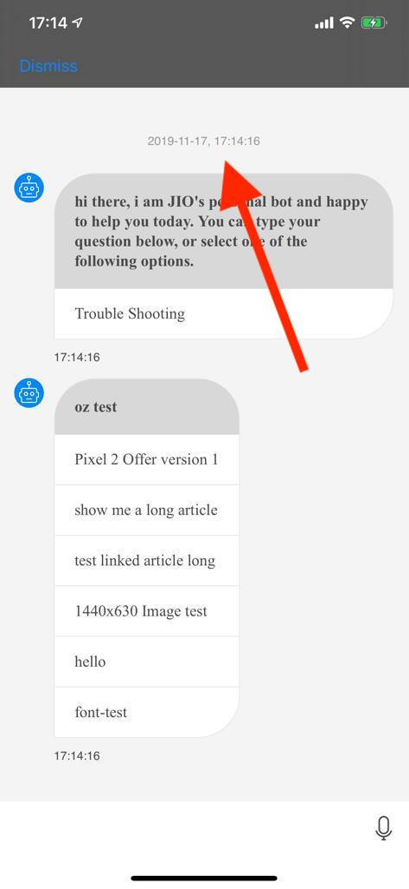
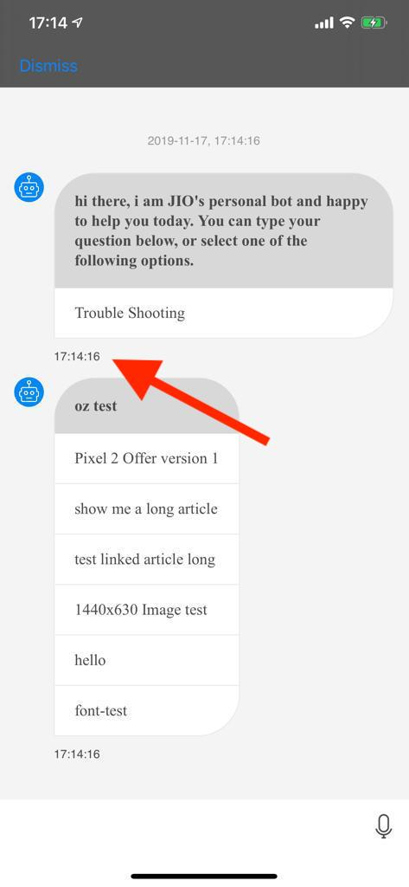

# Customizing UI components 
This article will help you customize initial chat view UI, and show you how to change UI on runtime according to live data.

In order to change and override provided SDK implementations and customizations, one need to provide his own changed `ChatConfiguration` instance on `ChatController.viewConfiguration`. 

## Supported Configurations


| Configuration Class Name     | Configuration Options                                                                                                               |
|------------------------------|-------------------------------------------------------------------------------------------------------------------------------------|
| `ChatViewConfiguration`      | backgroundColor, backgroundImage, dateStampColor, customFont                                                                        |
| `IncomingBotConfiguration`   | quickOptionConfig, persistentOptionConfig                                                                                           |
| `IncomingLiveConfiguration`  | backgroundColor, backgroundImage, dateStampColor, customFont, avatar, textColor                                                     |
| `OutgoingConfiguration`      | backgroundColor, backgroundImage, dateStampColor, customFont, avatar, textColor, sentSuccessfullyIcon, sentFailureIcon, pendingIcon |
| `CarouselConfiguration`      | backgroundColor, backgroundImage, dateStampColor, customFont, avatar, textColor                                                     |
| `SystemMessageConfiguration` | backgroundColor, backgroundImage, dateStampColor, customFont, avatar, textColor 
| `ChatBarConfiguration` | backgroundColor, font, textColor, image, agentName, endChatBtnTitle, endChatBtnTextColor, enabled


### How To Set Configuration

In following sample we will customize chat view.

```swift
self.chatController.viewConfiguration.chatViewConfig.backgroundImage = UIImage(named: "ww_back_light")
self.chatController.viewConfiguration.chatViewConfig.dateStampColor = UIColor.black
```

----

### Chat Element Date/ Time Format

To update chat element Date/ Time please choose chat element and update configuration.

>Note: Below sample changes only `incomingBotConfig` chat element.

1. Configure Chat Date Format

```swift
let dateFormatter = DateFormatter(),dateFormatter.dateFormat = "yyyy-MM-dd"
chatController.viewConfiguration.incomingBotConfig.dateFormatter = dateFormatter
```


2. Configure Chat Element Time Format

```swift
let timeFormatter = DateFormatter()
timeFormatter.dateFormat = "HH:mm:ss"
chatController.viewConfiguration.incomingBotConfig.timeFormatter = timeFormatter
```


----

### Set Custom Font

To set custom font first make sure to add the relevant file to project, then:

```swift
// For example our custom font is: `{CUSTOM_FONT_NAME}.ttf`
let font = CustomFont()
font.fontFileName = "{CUSTOM_FONT_NAME}.ttf"
font.font = UIFont(name: "{CUSTOM_FONT_NAME}", size: 15)
let font1 = CustomFont()
font1.fontFileName = "{CUSTOM_FONT_NAME}.otf"
font1.font = UIFont(name: "{CUSTOM_FONT_NAME}", size: 20)
self.chatController.viewConfiguration.outgoingConfig.customFont = font
self.chatController.viewConfiguration.incomingBotConfig.customFont = font1
self.chatController.viewConfiguration.incomingLiveConfig.customFont = font

```

## Avatar Positioning 

`ChatElementConfiguration` has a property `avatarPosition` of type `AvatarPosition` the default value for outgoing element is `AvatarPositionBottomLeft` and for incoming element is `AvatarPositionBottomRight` for changing the position:

```swift
self.chatController.viewConfiguration.incomingBotConfig.avatarPosition = .topLeft
```

### Avatar Position Options

``` Objective C
typedef NS_ENUM(NSInteger, AvatarPosition) {
    AvatarPositionTopLeft,
    AvatarPositionBottomLeft,
    AvatarPositionTopRight,
    AvatarPositionBottomRight
};
```
