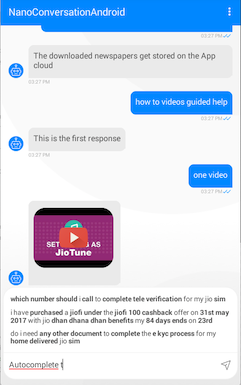

# Autocomplete support

## Standalone Bot autocomplete component
The SDK provides a standalone bot autocomplete component, `BotAutocompleteFragment`.
This component supports self state restoring, like on rotation mode changes.
> Landscape mode is not supported for autocompletion suggestions display. The suggestions to the text changes that were done in `Lanscape mode` will be displayed once device is back on `Portrait mode`. 
## How to use
### 1. Create autocomplete parameters
`BotAutocompleteFragment` uses `BotCompletionViewModel` to get its parameters.
`BotCompletionViewModel` should be obtained from `ViewModelProvider`, and customed as needed.   
#### - Obtaining `BotCompletionViewModel`
  When obtaining the `BotCompletionViewModel`, use the containing activity as the source for the ViewModelProvider.   
  ```kotlin
  // when fragment's parameters are filled by a fragment:
  val botViewModel = ViewModelProviders.of(activity!!).
                                get(BotCompletionViewModel::class.java)

  // when fragment's parameters are filled by the activity:
  val botViewModel = ViewModelProviders.of(this).
                                get(BotCompletionViewModel::class.java)                                
  ```
#### - Setting `BotCompletionViewModel` values                                
```kotlin

val botViewModel = ...

val account = BotAccount(...)
botViewModel.botChat.account = account 
// or set the botViewModel.botChat, if there's already an active instance 
// botViewModel.botChat = myBotChatInstance
```

### 2. Add to the application
 The `BotAutocompleteFragment` can  be added to an activity or to another fragment as with a regular fragment.
```kotlin
fragmentManager.beginTransaction()
            .add(R.id.root_layout, BotAutocompleteFragment()).commit()
```

#### 3. Optional - Listening to events
Set observers on the events you would like to be notified of.
```kotlin
// obtaining the BotCompletionViewModel object
val botViewModel =  ...

// set observer for errors:
botViewModel.onError.observe(this, Observer{ error ->
        error?.run { 
            //do something
        }
    })

// set observer for article selection from the suggestions:
botViewModel.onSelection.observe(this, Observer { selection ->
        // a utility method "getArticle" is passed over Selection object
        // BotAutocompleteFragment provides a "getArticle" method as well that can be used.
        selection?.getArticle?.invoke(selection.articleId) { result ->
            result.error?.run { 
                // handle error 
            } ?: result.data?.run { 
                // handle article
            }
        }
    })

// set observer for conversationId changes:
botViewModel.onConversationIdUpdate.observe(this, Observer { id ->
        // do something
    })
```

#### 4. Optional - Customize appearance 
The component UI configuration defined by `AutocompleteViewUIConfig`.
In order to change the config default properties values, create your own object and pass it on the `BotCompletionViewModel` (passed to the standalone).
```kotlin
val botViewModel = ViewModelProviders.of(...

val customedUIConfig = ChatAutocompleteUIConfig(context).apply { 
    // change properties values
    ... 
}

botViewModel.uiConfig = customedUIConfig
```

---

## <sub>Tip</sub>
In order to preseve the conversation created on state restoring of the containing activity/fragment, do not override the BotAccount on the `BotCompletionViewModel` object if already exists.
```kotlin
val botViewModel = ViewModelProviders.of(activity!!).get(BotCompletionViewModel::class.java);
        
if (!botViewModel.botChat.hasSession) {
    botViewModel.botChat.account = BotAccount(
        "8bad6dea-8da4-4679-a23f-b10e62c84de8",
        "jio",
        "Staging_Updated",
        "qa07"
    )
}
```
#
## In Chat autocomplete  
Chat SDK supports autocomplete for `bold ai` chats.     
While user is typing a query to the bot agent, if feature is enabled, he will be presented with suggested articles
relevant to the typed content.   


##
### How to enable/disable chat autocomplete support
- ### Enable/Disable on "Bold360ai" console</U>   
  There are 2 ways to set the autocomplete feature status in the console:
  1. #### [**Set on account settings**](./images/Android/ai-console-account-settings.png) 
        
  2. #### [**Set on widget settings**](./images/Android/ai-console-widget-settings.png)

- ### Enable/Disable on client side settings</U>   
  Set the feature enable status on the `ConversationSettings` that can be provided to `ChatController.Builder`.
  ```kotlin
  val settings = ConversationSettings().apply {
      // ...
      enableAutocompleteSupport(enable) // enable = true/false
  }

  val chatController = ChatController.Builder(context)  
                        .conversationSettings(settings)                                                   
                        .build(account, ...) 
                        
  ```
    ## 
  > **!! Notice:** _Client side settings overrides console settings._   
    But, in case the autocomplete was enabled on the client side but disabled on the bold ai console, on the account settings, though the autocomplete is enabled and passes requests, no suggestions will be received nor displayed.   
    ##


### How to configure
Autocomplete configurations should be set by `ChatUIProvider.chatInputUIProvider.uiConfig`
```kotlin
val uiProvider = ChatUIProvider(context).apply { 
            
                    chatInputUIProvider.uiConfig.apply { 
                        sendImage = ... // set send icon drawable
                        
                        popupBackground = // set suggestions window background
                        
                        inputStyleConfig = StyleConfig(...) // sets the text style for the input

                        suggestionUIConfig.apply {
                           
                            rowStyleConfig = StyleConfig() // sets the text style for each suggestion in the autocomplete window
                            
                            // In case another view layout is needed instead of SDK provided:
                            overrideFactory = object:CustomedAutocompleteUIConfig.SuggestionUIConfig.SuggestionFactory{
                                override fun create(context: Context, parent: ViewGroup): View {
                                    return TextView(context)
                                }

                                override fun update(view: View, text: Spannable?, style: StyleConfig?) {
                                    
                                }
                            }
                        }
                    }
                }

ChatController.Builder(this).apply {
    chatUIProvider(uiProvider)
}
```

### How to override
Autocomplete view can be replaced by user implementation.   
```kotlin
val uiProvider = ChatUIProvider(context).apply { 
                    chatInputUIProvider.overrideFactory = 
                        object : ChatInputUIProvider.ChatInputUIProviderFactory {
                                override fun create(context: Context): ChatInputViewProvider {
                                    return ... // return implementation here
                                }
                        }
                 }       