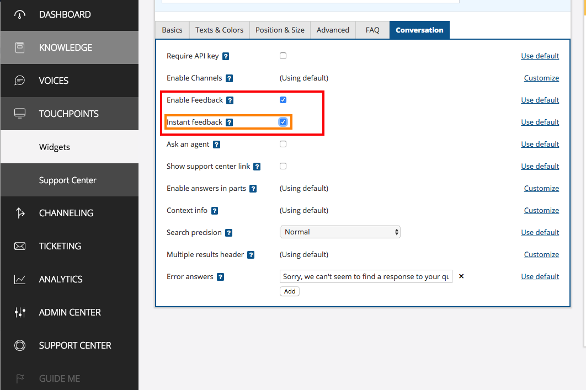
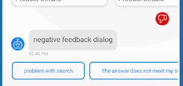
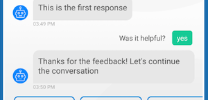

# Feedback

#### There are 2 types of supported feedback implementations provided by the SDK.

## 1. Timed Feedback    
If enabled, the configured timeout will be used to define inactive chat period to display the `Timed feedback`.   
This feedback type, enables the user to feedback on the chat as a total, up to the feedback time.   
- The Timed Feedback appears in the format of an incoming element and quick options to choose from. 
- Since the `Timed feedback`, is actually an incoming messages, it can't be specially configured.

 ### How to enable _Timed feedback_
 


## 2. Per Article Feedback <sub>(Instant feedback)</sub>   
If enabled, every valid article response will be followed with feedback element.   
This feedback type, enables the user to feedback per article/response.

### How to enable _Instant feedback_


**Instant feedback can be displayed with Textual/Iconic look, according to configurations.**   
The SDK provides default implementations for both types.

### Iconic feedback:   

|||
|---|---|
|||

### Textual feedback:   

|||
|---|---|
|||


### How to custom?
The instant feedback display can be override by the app, via `ChatUIProvider`.
1. Create your custom feedback view. Make it implement `FeedbackUIAdapter` interface.
    ```kotlin
    class CustomIconFeedbackView : LineaLayout, FeedbackUIAdapter {
        ...
    }

    class CustomTextFeedbackView : LineaLayout, FeedbackUIAdapter {
        ...
    }
    ```
2. Create implementation for `FeedbackFactory`, that creates your custom feedback view.
    ```kotlin
    class MyCustomFeedbackFactory : FeedbackFactory{
        override fun create(context: Context, feedbackDisplayType: Int): FeedbackUIAdapter {
            return when (feedbackDisplayType) {
                IconicFeedback -> CustomIconFeedbackView(context)
                else -> CustomTextFeedbackView(context)
            }
        }
    }
    ```
3. Set feedback provider factory to point to your implementation, in the `ChatUIProvider`. 
    ```kotlin
    val chatUIProvider = ChatUIProvider().apply{
        chatElementsUIProvider.incomingUIProvider.feedbackUIProvider.overrideFactory = MyCustomFeedbackFactory
    }

    val chatController = ChatController.Builder(context).apply {
                            chatUIProvider(chatUIProvider)
                            ....
                        }.build(account...)

    ```