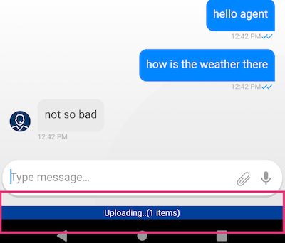

# Add File Upload support

The SDK provides an upload mechanism, but enables you to use your own.   
Follow the following steps to integrate upload functionality to your chat:
> If you don't use the SDK for chat ui creation, but want to use the provided uploader mechanism, go to [step 2.](#Use-SDK's-provided-uploader)

## 1.  Define your file upload trigger   
The UI component the user will use to trigger the upload. 

- ### Use SDK provided trigger   
  The SDK provides an upload trigger (attach icon) which will be positioned inside the input field.  In order to be notified when the user had activated the trigger in order to do some uploads, you need to implement `onUploadFileRequest` in `ChatEventListener`.
  ```kotlin
    override fun onUploadFileRequest(){
        // user wants to upload content to the agent
    }
  ```

  - #### Customize upload icon: 
    via `ChatInputUIProvider` config object.

    ```kotlin
    val chatController = ChatController.Builder(this).apply {
        ...
        chatUIProvider(ChatUIProvider().apply{
            chatInputUIProvider.uiConfig.uploadImage(...)
        })
        ...
    }
    ```

- #### Use your own trigger   
  - Apply your own upload UI component.   
    Insure that upload feature is enabled, before you display the UI to the user:
    ```kotlin
    chatController.isEnabled(ChatFeatures.FileUpload);
    ```
    > Learn how to enable/disable file transfer on admin console [here](./images/Android/ai-console-upload.png)
  - Hide the SDKs upload icon:

    ```kotlin
    val chatController = ChatController.Builder(this).apply {
        ...
        chatUIProvider(ChatUIProvider().apply{
            chatInputUIProvider.uiConfig.showUpload = false
        })
        ...
    }
    ```


## 2. Choose an upload provider

- ### Use SDK's provided uploader

  - Create a `FileUploadInfo` object, for every content you need to upload.

    ```kotlin
    //... user selected the file to upload
    val uploadInfo = FileUploadInfo().apply{
        type = ... // as defined in @FileType
        name = ... // can differ from the actual file name
        filePath = ... // actual selected file path
        content = file.readBytes()... // if was not provided on the constructor
    }
    ```
     
  - Activate the upload:
    
    1. When using the ChatController 
    
	```kotlin
    chatController.uploadFile(uploadInfo) { uploadResults ->
        //.... got UploadResults and do whatever
        uploadsResults.error?.run{
            Log.e(TAG, "Got an error on ${uploadResults.data.name} 
                                file upload: ${uploadsResults.error}")
            ...
        }
    }
    ```
    Upload results are passed over the provided callback.

	2. When using the Uploader
    ```kotlin
    BoldLiveUploader().upload(uploadInfo, AccountDetails(...)) { uploadResults ->
        //.... got UploadResults and do whatever
        uploadsResults.error?.run{
            Log.e(TAG, "Got an error on ${uploadResults.data.name} 
                                file upload: ${uploadsResults.error}")
            ...
        }
    }
    ```


- ### Use your own uploader

    - When user triggers an upload and chooses the content to be uploaded, upload that content with your uploader.
    - Pass an UploadEvent to the `chatController` with the upload results, in order to have the upload bubble in the chat.

      ```kotlin
      MyUploader.upload(...){
          //.... do upload stuff

          // pass results to the SDK
          val uploadResults = UploadResults(FileUploadInfo?, NRError?)
          chatController.handleEvent(Upload, new UploadEvent(uploadResult));
      }
      ```

## Extra

### Listening to upload notifications

One can listen to files upload events via the `ChatController`, by registering to the available uploads notifications he needs.

```kotlin
chatController.subscribeNotifications(notifiableImpl:Notifiable,
                    Notifications.UploadEnd, Notifications.UploadStart,
                    Notifications.UploadProgress, Notifications.UploadFailed)

// Notifiable implementation (notifiableImpl):
{
    ...

    override fun onNotify(notification: Notification, dispatcher: DispatchContinuation) {

        when (notification.notification) {
            Notifications.UploadStart,
            Notifications.UploadEnd,
            Notifications.UploadFailed -> {
                (notification as UploadNotification).apply {
                    // uploadInfo:FileUploadInfo member is available
                    ...
                }
            }

            Notifications.UploadProgress -> {
                (notification as ProgressNotification).apply {
                    // uploadInfo:FileUploadInfo member is available
                    // progress:Int member is also available
                    ...
                }
            }
        }
    }
}
```

### Customizations

- #### Customizing uploads progress indication
   The SDK provides uploads propress indication bar   

  

    - The uploads bar can customized via `ChatUIProvider.uploadsCmpUIProvider.configure`.

        ```kotlin
        // display uploads summary bar as floating component 
        chatUIProvider.uploadsCmpUIProvider.configure = { adapter:UploadsCmpAdapter->
            adapter.apply {
                ...            
            }
        }
        ```

    - The uploads bar can be overrided with your own implementation, via `ChatUIProvider.uploadsCmpUIProvider.overrideFactory`   
      ```kotlin
      chatUIProvider.uploadsCmpUIProvider.overrideFactory =
            object: UploadsbarCmpUIProvider.UploadFactory {
                override fun create(context: Context): UploadsCmpAdapter {
                    return .... // create customed component
                }
            }
      ```
      
    - In order to notify the SDK that the component done with the uploads display and should be removed, pass `CmpEvent` to the `ChatController`:

        ```kotlin
        chatController.handleEvent(CmpEvent.EventName,
                        CmpEvent(ComponentType.UploadsStripCmp, CmpEvent.Idle))
        ```
      > Customizations that were configured with `UploadsCmpUIProvider.configure` will be applied on your customed component as well.

- #### Customizing upload outgoing bubble
  Same as regular [outgoing bubble customizations](./ChatCustomizationsAndroid).

  - ##### Customizing upload content type images
    Provided icons can be override by appying new drawables resources in the app resources with matching reasources ids.   
    > picture_ico, default_ico, excel_ico, archive_ico
---
