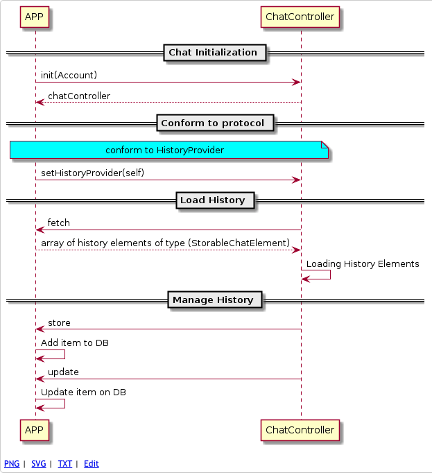

# Supported History Features

This section describes the different operations you can perform with the history service.

* **Fetch** - fetches history from DB.
* **Receive** - stores history item.
* **Remove** - removes history item. 
* **Update** - updates history item 
  > For Example: on failure history item can be updated to success.

## Known Limitations

* History management is currently not provided by the SDK,
  it should be done by the using app. 

## Overview

### Simple Flow  


<details>
  <summary>UML internal code</summary>

```
@startuml

== Chat Initialization ==

APP -> ChatController: init(Account)
ChatController --> APP: chatController

== Conform to protocol ==

note over APP, ChatController #aqua
	conform to ChatElementDelegate
end note

APP -> ChatController: setChatElementDelegate(self)

== Load History ==

ChatController -> APP: fetch
APP --> ChatController: array of history elements of type (StorableChatElement)
ChatController -> ChatController: Loading History Elements

== Manage History ==

ChatController -> APP: receive
APP -> APP: Add item to DB
ChatController -> APP: update
APP -> APP: Update item on DB

@enduml
```
</details>

## Usage  

### General API Notes  

The following classes/interfaces are the public API for history managment:

* **`ChatController`** - Use this class to set `ChatElementDelegate`.
*  Implement **`StorableChatElement`** to have your own storable chat element. (**optional**) 

### Basic Implementation

1. Create conversation view (via `ChatController`)

2. Conform to & Set `ChatElementDelegate`
 
```swift
controller.chatElementDelegate = self
```

3. Implement `ChatElementDelegate` Functions

```swift
func fetch(_ from: Int, handler: (([Any]?) -> Void)!) {
    print("fetch")
}

func didReceive(_ item: StorableChatElement!) {
    print("receive")
}

func didRemoveChatElement(_ timestampId: TimeInterval) {
    print("remove")
}

func didUpdateChatElement(_ timestampId: TimeInterval, newTimestamp: TimeInterval, status: StatementStatus) {
    print("update")
}
``` 
4. Present Chat viewController.

