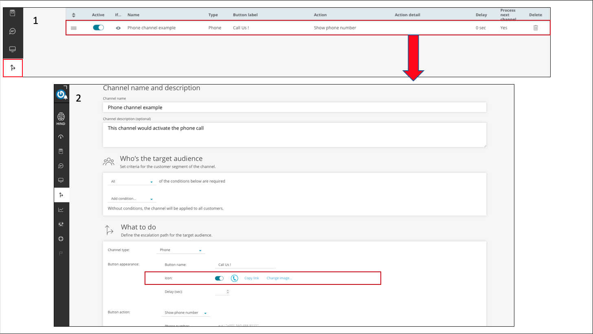

# Incoming chat component

## Readmore indication <sub><sup>(configurable only)</sub></sup>
- `readmore` indication view is configurable via `ReadmoreAdapter`, as follows:   

```kotlin
ChatUIProvider(context).apply {
    
    chatElementsUIProvider.incomingUIProvider.readmoreUIProvider.configure = { 
        adapter:ReadmoreAdapter -> 
        
        adapter.apply {
            alignReadmore(...)
            setReadmoreStyle(...)
            ...
        }
    }        
}
```
- `readmore` indication text, is a string resource (`R.string.read_more`), and can be override by the integrating app.

## Persistent options
Incoming bot response can have persistent options. Those options will not dissappear after user selection.   
#### How to customize
This kind of incoming element can be customized by overriding default implementation of the PersistentOptionsUIProvider.
- The options style can be configured by `PersistentOptionsUIProvider.optionsStyleConfig`   
- The wrapping bubble can be customized by `PersistentOptionsUIProvider.contentStyleConfig`
  ```kotlin
  ChatUIProvider(context).apply {
      
      chatElementsUIProvider.incomingUIProvider.persistentOptionsUIProvider.apply {
          // customize options text style:
          optionsStyleConfig = StyleConfig(...)
          
          // customize the wrapping bubble look:
          contentStyleConfig = { adapter -> 
              adapter.textBackground(...)
              
              // do more adjustments
          }
      }    
  }
  ```

- Options look can also be customized by override as follows:
```kotlin
ChatUIProvider(context).apply {
    
    chatElementsUIProvider.incomingUIProvider.persistentOptionsUIProvider.overrideFactory = 
                object : UIInfoFactory {
                    override fun info(): ViewInfo {
                        /* return your own ViewInfo object - 
                                which defines the layout resource for the options */
                    }
                }
}
```

## QuickOptions

Incoming bot response can have several options to the user to choose from. Those options are not constant and will dissappear after user action.


#### How to customize
1. ##### Customization by override.   
    Apply your own layout resource. 
    ```kotlin
    ChatUIProvider(context).apply {
        
        chatElementsUIProvider.incomingUIProvider.quickOptionsUIProvider.overrideFactory = 
            object : QuickOptionUIProvider.QuickOptionsFactory {
                override fun info(): ViewInfo {
                    /* return your own ViewInfo object - 
                                    which defines the layout resource for the options */
                }
            }
    ```
2. ##### Customization by properties change on `QuickOptionsUIProvider`.   
    

    ```kotlin
    uiProvider.chatElementsUIProvider
        .incomingUIProvider.quickOptionsUIProvider.apply { 
                optionsMargin = xxx // dp value
                startMargin = xxx // dp value
        }
    ```

### Channels

- Channels are a sub type of QuickOptions. Channels are used for user escalation actions.   
- Channels may appear as response options or on article page.  
- Channels can be created on the [Bold360ai console](https://support.bold360.com/ai).

#### <U>Customizing channels icons</U>
- #### By setting the icons via the Bold360ai console:
    

- #### By overriding SDK default icons. 
    
   - By overriding the channels drawable rescources:

        - Phone : `R.drawable.call_channel`
        - Chat : `R.drawable.chat_channel`
        - Ticket: `R.drawable.email_channel`

    - By overriding the icons generating method:

      ```kotlin
      ChatUIProvider(context).apply {
        chatElementsUIProvider.incomingUIProvider.quickOptionsUIProvider.overrideFactory =
            object : QuickOptionUIProvider.QuickOptionsFactory {
                override fun generateDefaultChannelImage(context: Context, channelType: Int): Drawable? {
                    // return drawable according to channelType
                }
            }
      ```

## Statement Injection

Statements can be injected to the chat from the App through the ChatController:

```kotlin
chatController.post(new IncomingStatement("message text"));
```
