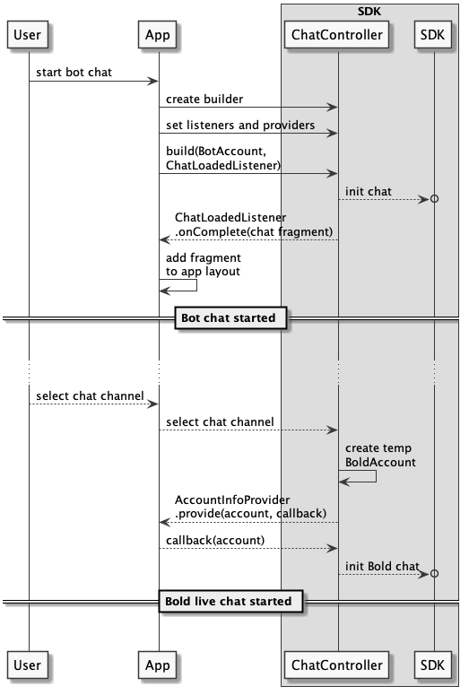

# BoldAccount
This account is used for starting a live Bold chat with an agent. [see "Quick Start"](QuickStartAndroid)


Live chat may start as main chat purpose, or be triggered from chat with BOT.

## Starting chat with Bold live
    A Bold live account should be provided over `ChatController` creation as follows:
    ```kotlin
    val account = BoldAccount(API_KEY)
    val chatController = ChatController.Builder(context)                                                     
                                        .build(account, ...)
    ```
    

## Starting chat with Bot and continue to Bold live
    - A chat typed channel should be configured on the Bold360ai console.<sup>[(*)](https://support.nanorep.com/API-Integrations/Chat-Integration/1009694282/How-to-integrate-LiveChat-Inc-chat.htm)</sup>.   
    - Bold live chat can than be triggered by user selection of that channel.    
    - App will be asked to `provide` (over `AccountInfoProvider`), the BoldAccount that matches the details provided by that channel. (If `AccountInfoProvider` implementation was not provided, the chat will start with default configurations.)   
    
    


### Listening to account updates
In order to get account info updates, like visitoId, chatId and other details that were filled by the user on the prechat, an implementation of `AccountInfoProvider` should be set on `Chatcontroller.Builder` 
```kotlin
val chatController = ChatController.Builder(context) 
                    .accountProvider(accountInfoProviderImpl)
                    ...
                    .build(account,...)
```

- When the SDK asks for account from the app, (as in live chat start from bot chat), the `provide` method will be activated.
- When account's info was updated, as when chat created and prechat submitted, the `update` method will be activated.

```kotlin
class MyAccountProviderImpl : AccountInfoProvider{
    override fun provide(accountInfo: AccountInfo, callback:    Completion<AccountInfo>) {
        // get app saved account matching the parameter one [accountInfo.getApiKey()]
        // pass the account to the SDK over the callback:
        callback.onComplete(app_account)
    }

    override fun update(account: AccountInfo) {
        // get app saved account matching the parameter one [accountInfo.getApiKey()]
        // update the account:
        app_account.update(account) // inner info will be updated    
    }
}
```

### How can i access current chat info
While a live chat goes through the chat lifecycle, chat info will be updated with some ids and details. In order to see those details, access the accounts `info` property.

- How to get the VisitorId:   

        kotlin -> account.info.visitorId 
                    OR 
                  account.info.id
        
        java   -> getVisitorId(account.getInfo()) 
                    OR 
                  account.getInfo().getId()


- How to get the chatId:

        kotlin -> acount.info.chatId
        
        java   -> getChatId(account.getInfo())

- How to skip prechat:

        kotlin -> boldAccount.skipPrechat()
                    OR
                  account.info.skipPrachat(true)

        java   -> boldAccount.skipPrechat()
                    OR
                  setSkipPrechat(account.getInfo(), true);
 

### How to configure the created chat
Some configurations may be applied over the account in order to define aspects of the created chat. Like langauge, prechat form fields values, **passing `visitorId` to enable continuation of previous chats**, etc.    
For that purpose we have the `extraData` on the account `info` member. (see `VisitorDataKeys` for the list of configurable data)

- How to set chat language:
  
      account.addExtraData(VisitorDataKeys.Language to "fr-FR")
  
- How to set a specific department: <sub>_**(needed when skipPrechat is enabled)**_</sub>
        
      account.addExtraData(VisitorDataKeys.Department to 2279019778245965656)
  
- How to set details for the prechat:
      
      account.addExtraData(VisitorDataKeys.FirstName to "Ando",
                            VisitorDataKeys.LastName to "Roid",
                            VisitorDataKeys.Email to "a@gmail.com",
                            ...)

- How to set the `visitorId`:   

      account.info.visitorId = ...
 