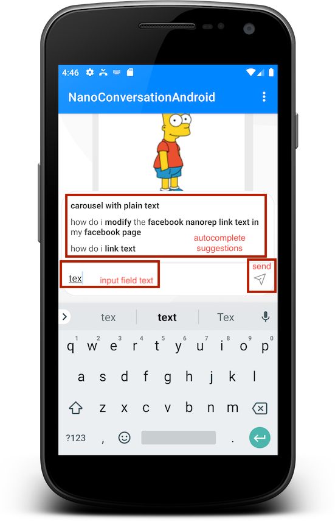
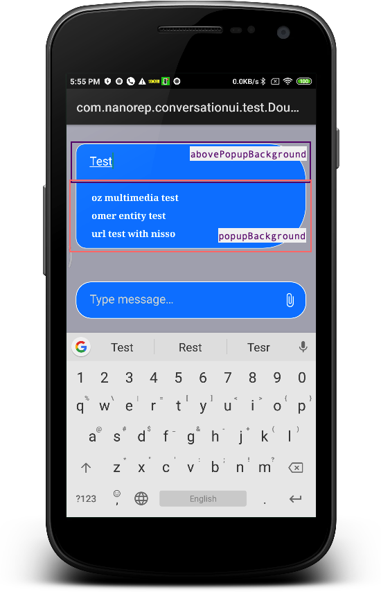
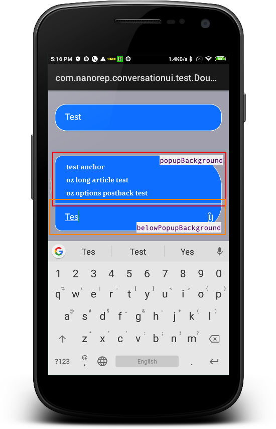

# User input field

Usually appears at the bottom of the chat screen. Contains the users typed/recorded message, until it was sent.   
The behavior and functionality of the input field is defined by the active chat type.   
> Exp: The **upload icon** will appear only on live chats and only if was enabled by configuration.

## Available features
- Typing and sending messages 
- [Autocomplete](./AutocompleteInChatAndroid.md)
- [Voice recording and readout control](./voice-to-voice-android.md)
- [File upload](./FileUploadAndroid.md) on live chats

## ConversationSettings configurations
Some of the available features, can be controlled by the embedding App, via `ConversationSettings` object, that can be provided on ChatController creation.  
- [`voiceSettings(VoiceSettings)`](./ChatSettingsAndroid.md#Voice-control)
- `enableAutocompleteSupport(Boolean)`

## UI customization
The user input field can be customized by:
- ### Configuration   
  The SDK provides a configurable _user input field_ implementation.
  The default configuration can be changed via `ChatUIProvider.chatInputUIProvider.uiConfig` and `ChatUIProvider.chatInputUIProvider.SendCmpUIProvider.uiConfig` <sub>(from 4.1.0)</sub>
  
  ```kotlin
  val customProvider = ChatUIProvider(context).apply{
      chatInputUIProvider.uiConfig.apply{
        uploadImage = ...
        belowPopupBackground = ... // autocomplete suggestions open downward image
        abovePopupBackground = ... // autocomplete suggestions open upward image
        noPopupBackground = ... // input field background when there are no autocomplete suggestions 
        suggestionUIConfig = ... // defines config for the autocomplete suggestions rows 
        inputStyleConfig = ... // the style of the input field text
        ...
      }

      chatInputUIProvider.SendCmpUIProvider.uiConfig.apply{
          speecherUIConfig.apply{
            speakerImage = ... // speaker icon, presented while response is being read to the user
            micImage = ... // recording voice icon
          }
          
          sendImage = ... // message send icon
      }
  }

  val chatController = ChatController.Builder(context)
    ...
    .chatUIProvider(customProvider)
    .build(...)
```
```

|||
|---|---|---|
|||


- ### Override
In case a customed view is needed instead of supplied SDKs implementation, set `ChatUIProvider.chatInputUIProvider.overrideFactory` with your view factory.
> Custom implementation must implement `ChatInputViewProvider`
  
- In order to override the send view set `ChatUIProvider.chatInputUIProvider.sendCmpUIProvider.overrideFactory` with your view factory.
> Custom implementation must implement `InputControlersHandler`
